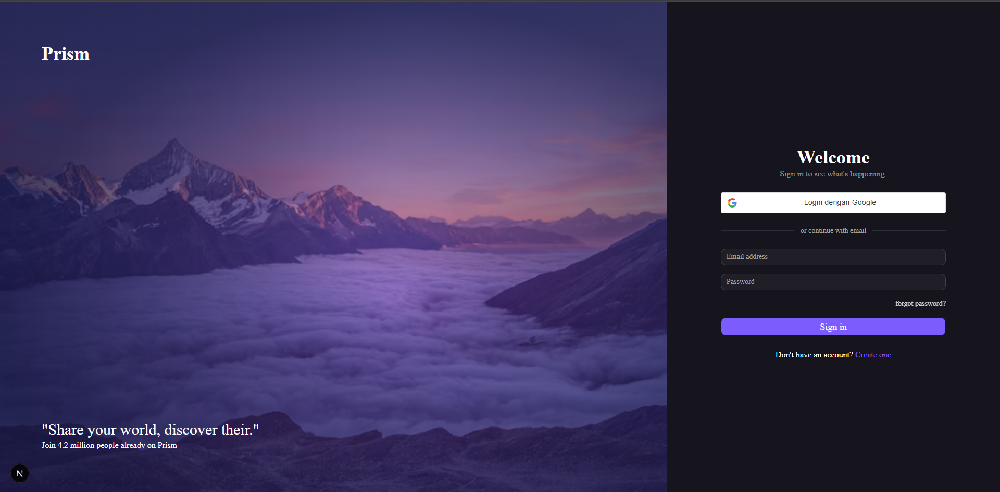
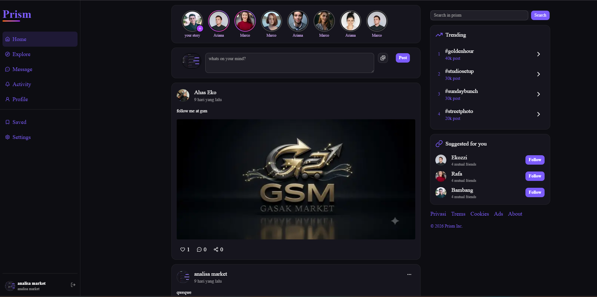
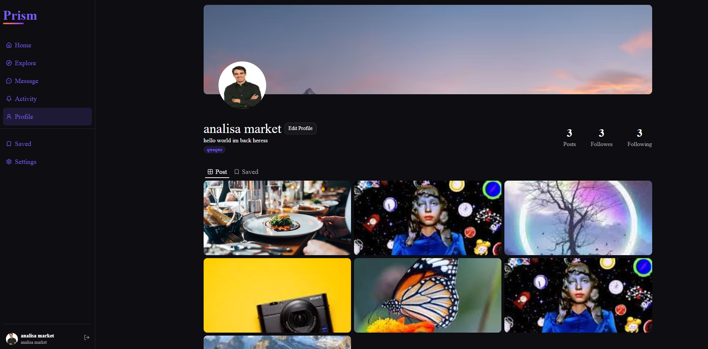
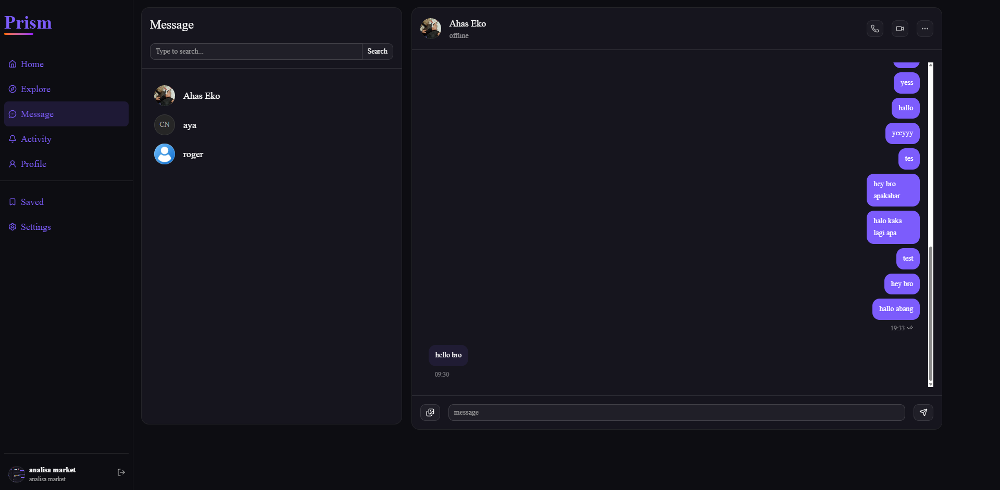

# 🌐 Social Media Prism

A modern full-stack social media application built with **Next.js**, **Express.js**, **MongoDB**, and **Socket.IO**.

This project is organized as a **monorepo**, making it easy to develop, test, and deploy both frontend and backend services together.

---

## 📸 Features

### Authentication

- Email & Password Login
- Google OAuth Login
- JWT Authentication
- Secure HttpOnly Cookie Session

### User

- User Profile
- Edit Profile
- Upload Avatar
- User Search
- Follow / Unfollow Users

### Posts

- Create Post
- Upload Multiple Images
- Delete Post
- Feed Timeline
- User Posts
- Image Posts

### Social

- Like Posts
- Comment Posts
- Follow Activity

### Chat

- Real-time Messaging
- Socket.IO
- Online Users

### Developer Experience

- TypeScript
- ESLint
- Docker
- Docker Compose
- GitHub Actions CI/CD

---

# 🏗 Tech Stack

## Frontend

- Next.js 16
- React 19
- TypeScript
- TailwindCSS
- shadcn/ui
- SWR
- Socket.IO Client

## Backend

- Express.js
- MongoDB Atlas
- Mongoose
- JWT
- Google OAuth
- Cloudinary
- Socket.IO

## DevOps

- Docker
- Docker Compose
- GitHub Actions
- Docker Hub
- Netlify
- Render

---

# 📁 Project Structure

```text
social-media-bundle/
│
├── social-media/          # Next.js Frontend
│
├── social-media-be/       # Express Backend
│
├── docker-compose.yml
│
└── .github/
    └── workflows/
```

---

# 🚀 Running Locally

## Clone

```bash
git clone https://github.com/your-username/social-media-bundle.git
```

```bash
cd social-media-bundle
```

---

## Environment Variables

Create a `.env` file in the project root.

```env
NEXT_PUBLIC_API_URL=http://localhost:3001
NEXT_PUBLIC_SOCKET_URL=http://localhost:3001

NEXT_PUBLIC_GOOGLE_CLIENT_ID=

GOOGLE_CLIENT_ID=

JWT_SECRET=

COOKIE_NAME=

MONGODB_URI=

CLIENT_URL=http://localhost:3000

CLOUDINARY_NAME=
CLOUDINARY_API_KEY=
CLOUDINARY_SECRET_KEY=
```

---

## Docker

Run

```bash
docker compose up --build
```

Frontend

```
http://localhost:3000
```

Backend

```
http://localhost:3001
```

---

# 🧪 Development

Frontend

```bash
cd social-media
npm install
npm run dev
```

Backend

```bash
cd social-media-be
npm install
npm run dev
```

---

# 🐳 Docker

Build Images

```bash
docker compose build
```

Run Containers

```bash
docker compose up
```

Stop

```bash
docker compose down
```

---

# 🔄 CI/CD

The project uses GitHub Actions for Continuous Integration and Continuous Deployment.

Workflow:

```text
Push
 │
 ▼
Frontend Test
 │
Backend Test
 │
Docker Build
 │
Push Docker Hub
 │
Deploy Netlify
 │
Deploy Render
```

---

# 🌍 Deployment

Frontend

- Netlify
  https://sosial-mediaa.netlify.app/

Backend

- Render

Docker Images

- Docker Hub

---

# 📷 Screenshots

### Login



### Feed



### Profile



### Chat



---

# 📌 Future Improvements

- Notifications
- Infinite Scroll
- Story Feature
- Video Upload
- Bookmark Posts
- Dark Mode
- Push Notification
- Group Chat
- End-to-End Encryption

---

# 👨‍💻 Author

**Ahas Eko Septianto**

GitHub

https://github.com/AhasEkoSeptianto

LinkedIn

https://www.linkedin.com/in/ahas-eko-septianto-765892202

---

# ⭐ Support

If you like this project, don't forget to give it a ⭐ on GitHub!
